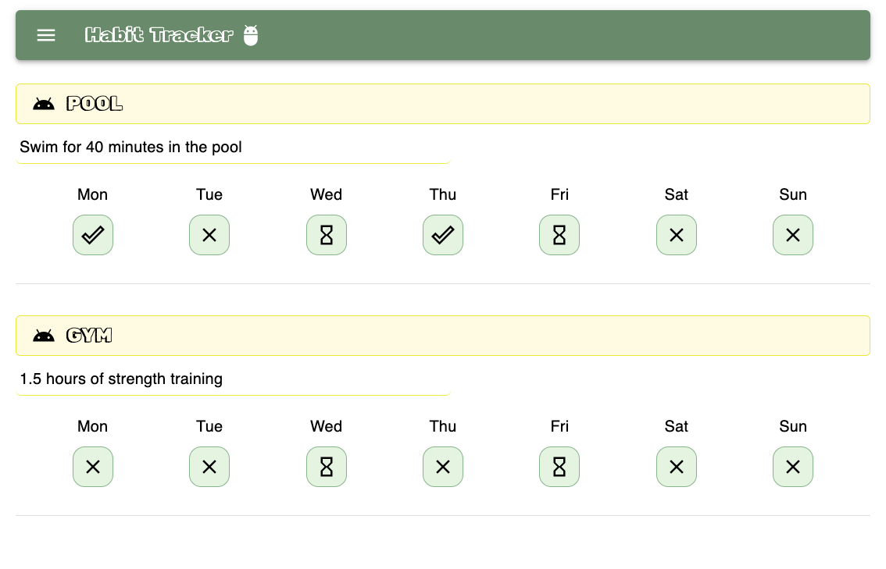
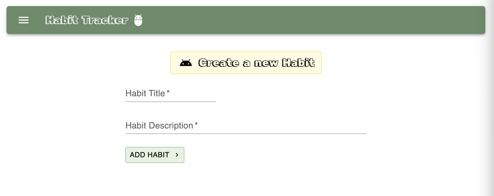

# React + TypeScript + Vite

# ⭐ HabitTracker — Stay on Track, Build Better Habits

Welcome to **HabitTracker** — a sleek and minimalistic app to help you build, track, and maintain powerful habits 🚀. Whether you're aiming to drink more water, play the guitar, read every day, or exercise regularly, this app has your back.

🚀  [Open HabitTracker App](https://habit-tracker-react-ts.netlify.app/)






## 🔧 Tech Stack

- ⚛️ **React** — Fast and component-based UI
- 🧑‍💻 **TypeScript** — Is a strongly typed programming language
- 📦 **Redux Toolkit (RTK)** — Scalable and organized state management
- 🎨 **Material UI (MUI)** — Clean and responsive design system
- 🎯 **CSS** — Custom styling for layout 
- ⚡ **Vite** — Blazing fast development environment

## ✨ Features

- 📆 Weekly habit tracking
- 🔁 Status cycling between DONE, NOT_DONE, and NONE
- 📈 Clean UI & UX
- 💾 Store state via Redux

## 🚀 Getting Started

Clone the repo and start the development server:

```bash
git clone 
cd habit-tracker-react-ts
npm install
npm run dev
